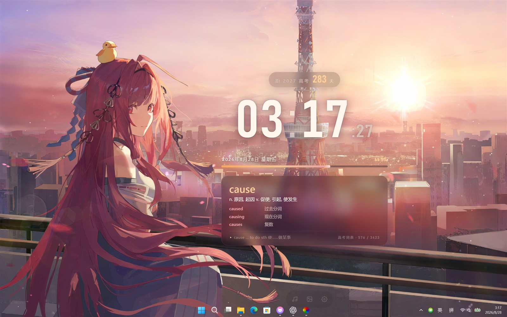

# wallpaper11

为教室 Windows 希沃白板（触屏一体机）设计的交互式动态壁纸，通过 [Lively Wallpaper](https://github.com/rocksdanister/lively) 运行。



## 功能

- 背景视频、大数字时钟、日期、年度进度和高考倒计时
- 高考词表，随机展示中文释义、词族和常用搭配
- 底部工具栏：音乐播放器、今日作业和壁纸设置
- 本机音乐、LRC 歌词和网易云搜索
- Lively 暂停壁纸时，同步暂停背景视频和音乐

## 使用方法

### 推荐：一体化安装包

在目标电脑上直接运行 **`wallpaper11-setup.exe`**，它会自动完成：

1. 检测并安装 [Lively Wallpaper](https://github.com/rocksdanister/lively)（安装包已内置于 `wallpaper11-setup.exe`，教室断网也能装）；
2. 安装 [wallpaper11 本地 Music Bridge](https://github.com/NeteaseCloudMusicApiEnhanced/api-enhanced)；
3. 把 wallpaper11 导入 Lively 壁纸库；
4. 立即将 wallpaper11 设为当前壁纸。

全程不需要 Node.js、npm、Git、管理员权限，也不用手动拖入 ZIP。首次安装时 Windows 可能弹出「用户账户控制」（为安装 VC++/.NET 运行库），点击「是」即可，安装页会显示进度字幕（Lively → Music Bridge → 导入并应用壁纸）。安装后打开壁纸底部设置，确认 **Music Bridge** 显示「已连接」，再粘贴 `MUSIC_U` 并验证即可。

> 需要在壁纸内键入搜索内容时，在 Lively「壁纸 → 交互 → 壁纸输入」中开启键盘输入；使「其他应用获得焦点时」暂停壁纸的选项位于 Lively「性能」设置。

### 备用：手动组件

仅当无法使用一体化安装包时：

1. 安装 Lively Wallpaper 后，把 `wallpaper11-lively.zip` 拖入 Lively 完成导入，再设为壁纸（使用 **WebView2** 网页引擎）。
2. 网易云组件手动运行 `wallpaper11-music-setup.exe`。不用网易云时可跳过。

`wallpaper11-music-setup.exe` 保留作为备用安装方式，正式推荐只使用 `wallpaper11-setup.exe`。

### 日常操作

桌面底部中间的低调工具栏包含：

- **音乐**：打开播放器，切换本机歌单或搜索网易云。
- **作业**：选择、更换或清空今日作业图片。
- **设置**：修改高考日期、时钟、背景播放、界面缩放和网易云登录。

背景视频、作业图片和其他持久选项也可在 Lively 图库中右键壁纸，选择「自定义」进行修改。

## 卸载

在 Windows「已安装的应用」中卸载 **wallpaper11**：

- 卸载会停止并删除 Music Bridge（含自启动快捷方式），删除 wallpaper11 壁纸本体（仅限属于 wallpaper11 的库目录）。
- **不会**卸载 Lively Wallpaper，也不会删除其他 Lively 壁纸或用户数据。
- Lively 若不再需要，可另行单独卸载，此时可在提示中选择是否保留本地数据目录。

## 本地媒体与打包

仅开发或自行制作壁纸包时需要 Node.js 18 或更高版本。将文件放入：

```text
local-video/       背景视频
local-music/       音乐与同名 LRC 歌词
local-homework/    作业图片
```

常用命令：

```powershell
npm run dev             # 启动本地预览 http://127.0.0.1:1420
npm run check           # 检查 Lively 项目和词库
npm run package         # 生成 dist/wallpaper11-lively.zip
npm run music:package   # 生成 dist/wallpaper11-music-setup.exe（备用）
npm run setup           # 生成 dist/wallpaper11-setup.exe 一体化安装包（内嵌 Lively，离线安装）
```

一体化安装包构建过程：本地需要 Inno Setup Compiler（`npm run setup` 找不到时会自动下载便携版到 `dist\.setup-build\`）；Lively 安装包按顺序使用 `LIVELY_SETUP_EXE` 环境变量指定的文件、`Downloads` 目录中已有的 `lively_setup_x86_full_v2210.exe`，或从 GitHub Release 下载并缓存到 `dist\.setup-build\lively\` 供后续复用。产物始终包含完整 Lively 安装包，目标机安装全程不需要联网。

产物未签名，首次运行若出现 Windows 智能屏幕提示，选择「仍要运行」即可。

媒体文件、Cookie 和 `dist/` 产物不会提交到 Git。项目使用 [NeteaseCloudMusicApi Enhanced](https://github.com/NeteaseCloudMusicApiEnhanced/api-enhanced) 提供网易云连接，词形数据来自 MIT 许可的 [ECDICT](https://github.com/skywind3000/ECDICT)。
